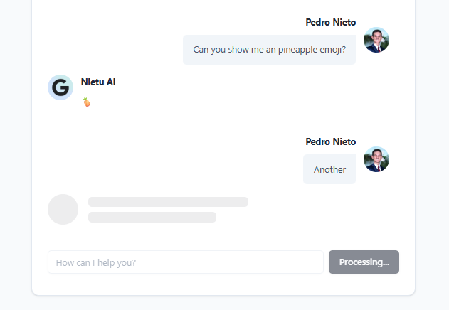

# AI Chat
An AI-powered chat application built with Next.js, TypeScript, and Tailwind CSS. It features user authentication, real-time messaging, and a sleek UI using Radix UI components.

<p align="center">
  
</p>
<p align="center">
  
</p>

## Features
- User authentication with NextAuth.js
- Real-time chat functionality
- Accessible UI with Radix UI components
- Markdown support in messages
 
## Technologies Used
- Next.js
- TypeScript
- Tailwind CSS
- Radix UI
- NextAuth.js
- React Markdown
- Remark GFM 

## Getting Started
1. Clone the repository:
   ```bash
   git clone https://github.com/Pedroo-Nietoo/AI-Chat.git
   ```
2. Navigate to the project directory:
   ```bash
   cd ai-chat
   ```
  
3. Install dependencies:
   ```bash
   npm install
   ```
4. Create a `.env.local` file and add your environment variables (e.g., Gemini API key, NextAuth secret).

5. Set up the OAuth providers in your NextAuth configuration.
  
6. Run the development server:
   ```bash
   npm run dev
   ```

7. Open [http://localhost:3000](http://localhost:3000) in your browser to see the app.